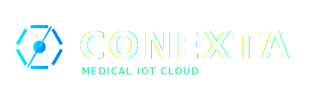

# 

**Conexta** is a futuristic web platform designed to bridge legacy medical devices (analog output) with modern cloud IoT workflows. It provides real-time monitoring, comprehensive dashboards for different hospital roles, and multi-language support for diverse healthcare environments.

## ✨ Features

### 1. 🏥 Multi-Persona Dashboards
-   **👨‍⚕️ Doctor Cockpit**: 
    -   Hierarchical view of the entire hospital (Clinical, Diagnostic, Critical Care).
    -   Drill-down navigation: Departments → Equipment → Patient Lists.
    -   Real-time equipment utilization tables (Active, Pending, Treated).
    -   High-visibility visual design with white text and gold highlights for selected items.
-   **🏥 Patient View**:
    -   Live ECG waveform animation 💓.
    -   Personalized health timeline (Morning/Afternoon/Night) 💊.
    -   Prescriptions and Health Tips.
-   **🛠️ Engineer Panel**:
    -   Device inventory management.
    -   Maintenance alerts (AMC expiring, Calibration due) ⚠️.
    -   Device status monitoring (Online/Offline/Attention).

### 2. 🌍 Comprehensive Internationalization (i18n)
Full translation support for **9 languages**:
-   🇺🇸 English
-   🇮🇳 Tamil (தமிழ்)
-   🇮🇳 Malayalam (മലയാളം)
-   🇵🇰 Urdu (اردو)
-   🇮🇳 Telugu (తెలుగు)
-   🇮🇳 Kannada (ಕನ್ನಡ)
-   🇮🇳 Marathi (मराठी)
-   🇮🇳 Odia (ଓଡ଼ିଆ)
-   🇮🇳 Hindi (हिंदी)

All UI elements, including dynamic dashboards and navigation, instantly adapt to the selected language.

### 3. 🚀 Futuristic UI/UX
-   **🔮 Glassmorphism Design**: Translucent cards, subtle glows, and dark mode aesthetics.
-   **✨ Fluid Animations**: Smooth page transitions, entrance animations, and pulse effects for critical alerts.
-   **📱 Responsive Layout**: Adapts seamlessly to tablets and desktop screens.

## 💻 Tech Stack
-   **Core**: Vanilla JavaScript (ES6+), HTML5, CSS3.
-   **Styling**: Custom CSS variables for theming, Flexbox/Grid layouts.
-   **No Framework Build**: Lightweight, fast-loading, and no complex build steps required.

## 🛠️ Setup & Usage
1.  **Clone the repository**:
    ```bash
    git clone https://github.com/MedEngger/Conexta.git
    ```
2.  **Open `index.html`**:
    Simply open the `index.html` file in any modern web browser. 
    > 💡 **Tip**: Use "Live Server" extension in VS Code for the best experience with routing.

## 📂 Project Structure
-   `index.html`: Main entry point and app shell.
-   `assets/`: Images and branding assets.
-   `styles/`: 
    -   `main.css`: Core variables and base styles.
    -   `animations.css`: Keyframe animations and transitions.
-   `js/`:
    -   `main.js`: App initialization.
    -   `router.js`: Hash-based client-side routing.
    -   `i18n.js`: Translation dictionary and logic.
    -   `fakeData.js`: Simulation data generators.
    -   `components/`: Individual view logic.

## 🤝 Contributing
1.  Fork the repository.
2.  Create a feature branch.
3.  Commit your changes.
4.  Push to the branch.
5.  Open a Pull Request.

---
*Built for the Future of Medical IoT 🌐*


